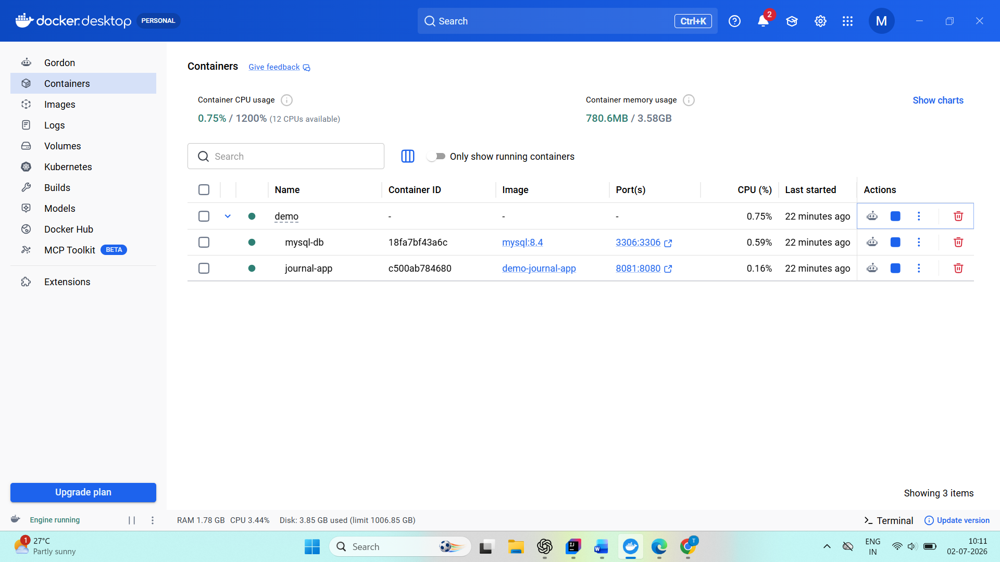

# 📓 Journal Management API

A production-ready **Spring Boot REST API** for managing personal journal entries with **JWT Authentication**, **Spring Security**, **MySQL**, and **Docker**.

---

## 🚀 Features

- 🔐 JWT Authentication & Authorization
- 👤 User Registration & Login
- 📝 Journal CRUD Operations
- ✏️ Update User Profile
- 🗑️ Delete User Profile
- 📚 Swagger/OpenAPI Documentation
- ✅ Request Validation
- ⚠️ Global Exception Handling
- 🗄️ MySQL Database
- 🐳 Docker & Docker Compose Support
- 🌱 Environment-based Configuration (Dev & Prod)

---

## 🛠️ Tech Stack

- Java 21
- Spring Boot 3.5
- Spring Security
- Spring Data JPA (Hibernate)
- MySQL 8
- JWT
- Maven
- Docker
- Docker Compose
- Swagger (OpenAPI 3)

---

## 📂 Project Structure

```
src
├── configuration
├── controller
├── dto
├── entity
├── enums
├── exception
├── repository
├── security
├── service
```

---

## ⚙️ Environment Variables

Create a `.env` file in the project root.

```env
DB_URL=jdbc:mysql://mysql-db:3306/DB_NAME
DB_USERNAME=YOUR_USERNAME
DB_PASSWORD=YOUR_PASSWORD

JWT_SECRET=your-secret-key
JWT_EXPIRATION=86400000

EMAIL_USERNAME=your-email@gmail.com
APP_PASSWORD=your-app-password

QUOTE_URL=https://dummyjson.com/quotes/random

SPRING_PROFILES_ACTIVE=prod
```

---

## ▶️ Run Locally

Clone the repository

```bash
git clone https://github.com/Tanushri014/journal-management-api.git
```

Move into the project

```bash
cd journal-management-api
```

Build the project

```bash
mvn clean package
```

Run the application

```bash
mvn spring-boot:run
```

---

## 🐳 Run with Docker

Build the image

```bash
docker compose build
```

Start the containers

```bash
docker compose up -d
```

Stop the containers

```bash
docker compose down
```

---

## 📖 API Documentation

Swagger UI

```
http://localhost:8081/swagger-ui/index.html
```

OpenAPI JSON

```
http://localhost:8081/v3/api-docs
```

---

## 🔐 Authentication

1. Register a user.
2. Login using your credentials.
3. Copy the JWT token.
4. Click **Authorize** in Swagger.
5. Enter:

```
Bearer <your_token>
```

6. Access secured APIs.

---

## 📌 API Endpoints

### Authentication

- Register User
- Login User

### User

- Get Profile
- Update Profile
- Delete Profile

### Journal

- Create Journal Entry
- Get All Entries
- Get Entry By ID
- Update Entry
- Delete Entry

---

## 🗃️ Database

- MySQL 8
- Spring Data JPA
- Hibernate

Database schema is automatically updated using:

```yaml
spring.jpa.hibernate.ddl-auto=update
```

---

## 🐳 Docker

This project is fully containerized using Docker.

Containers:

- journal-app
- mysql-db

---

## 📸 Screenshots

### Docker Containers



---

## 👨‍💻 Author

**Tanushri Matre**

GitHub: https://github.com/Tanushri014

LinkedIn: www.linkedin.com/in/tanushri-matre-9756982a7

---

